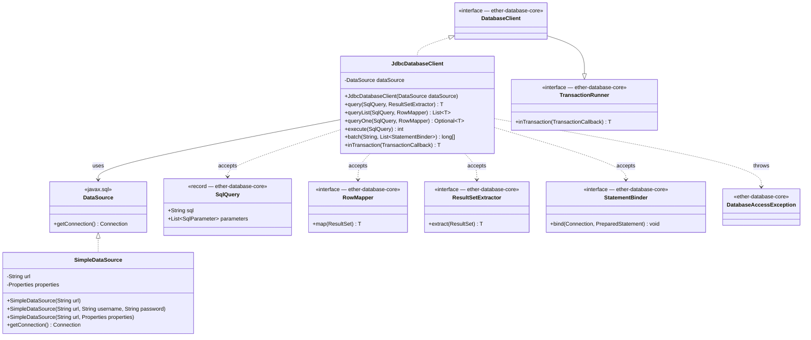

# ether-jdbc

JDBC-first implementation of the `ether-database-core` contracts. This module provides `JdbcDatabaseClient` — a complete `DatabaseClient` backed by any `javax.sql.DataSource` — and `SimpleDataSource`, a zero-dependency `DataSource` that uses `DriverManager` directly. No Spring, no Hibernate, no external connection pool library is required.

## Maven Dependency

```xml
<dependency>
    <groupId>dev.rafex.ether.jdbc</groupId>
    <artifactId>ether-jdbc</artifactId>
    <version>8.0.0-SNAPSHOT</version>
</dependency>
```

`ether-jdbc` declares `ether-database-core` as a compile-scope dependency, so you do not need to add it separately.

You must also add a JDBC driver for your database. For PostgreSQL:

```xml
<dependency>
    <groupId>org.postgresql</groupId>
    <artifactId>postgresql</artifactId>
    <version>42.7.3</version>
    <scope>runtime</scope>
</dependency>
```

---

## Architecture



---

## Components

### JdbcDatabaseClient

Implements all five `DatabaseClient` methods plus `inTransaction`. Every public method acquires a connection from the injected `DataSource`, executes the statement, and releases the connection via try-with-resources. Parameters are bound using `SqlParameter` metadata: plain values use `setObject`, typed values use `setObject(index, value, sqlType)`, null values use `setNull`, and arrays use `connection.createArrayOf` plus `setArray`.

The `inTransaction` method saves and restores the connection's `autoCommit` state around the transaction boundary.

### SimpleDataSource

A minimal `DataSource` implementation that delegates to `DriverManager.getConnection`. Appropriate for tests, small utilities, or environments where a pooling library is not available. For production workloads, use a pooling `DataSource` such as HikariCP or c3p0 — `JdbcDatabaseClient` accepts any `javax.sql.DataSource`.

---

## Example 1 — Create JdbcDatabaseClient with SimpleDataSource

```java
import dev.rafex.ether.jdbc.client.JdbcDatabaseClient;
import dev.rafex.ether.jdbc.datasource.SimpleDataSource;

// The JDBC driver is loaded automatically by DriverManager in Java 9+
// as long as the driver JAR is on the classpath.

// Option A: URL only (credentials embedded in the URL)
var dataSource = new SimpleDataSource(
    "jdbc:postgresql://localhost:5432/mydb?user=app&password=secret"
);

// Option B: separate username and password
var dataSource2 = new SimpleDataSource(
    "jdbc:postgresql://localhost:5432/mydb", "app", "secret"
);

// Option C: Properties object for advanced driver settings
var props = new java.util.Properties();
props.setProperty("user", "app");
props.setProperty("password", "secret");
props.setProperty("ssl", "true");
var dataSource3 = new SimpleDataSource("jdbc:postgresql://localhost:5432/mydb", props);

// Wrap in JdbcDatabaseClient — the single object used throughout the application.
var db = new JdbcDatabaseClient(dataSource2);
```

---

## Example 2 — Full CRUD with a User Entity

Define the domain types:

```java
package com.example;

import java.time.Instant;
import java.util.UUID;

public record User(UUID id, String email, String role, Instant createdAt) {}
```

```java
package com.example;

import dev.rafex.ether.database.core.mapping.ResultSets;
import dev.rafex.ether.database.core.mapping.RowMapper;

// Reusable, thread-safe row mapper declared as a constant.
public final class UserMapper {
    public static final RowMapper<User> INSTANCE = rs -> new User(
        ResultSets.getUuid(rs, "id"),
        rs.getString("email"),
        rs.getString("role"),
        ResultSets.getInstant(rs, "created_at")
    );
    private UserMapper() {}
}
```

```java
package com.example;

import java.util.List;
import java.util.Optional;
import java.util.UUID;

import dev.rafex.ether.database.core.DatabaseClient;
import dev.rafex.ether.database.core.sql.SqlBuilder;
import dev.rafex.ether.database.core.sql.SqlQuery;
import dev.rafex.ether.jdbc.client.JdbcDatabaseClient;
import dev.rafex.ether.jdbc.datasource.SimpleDataSource;

public final class UserRepository {

    private final DatabaseClient db;

    public UserRepository(DatabaseClient db) {
        this.db = db;
    }

    // CREATE
    public int insert(User user) {
        SqlQuery q = new SqlBuilder("INSERT INTO users (id, email, role, created_at) VALUES (")
            .param(user.id())
            .append(", ").param(user.email())
            .append(", ").param(user.role())
            .append(", ").param(user.createdAt())
            .append(")")
            .build();
        return db.execute(q);
    }

    // READ — single row
    public Optional<User> findById(UUID id) {
        SqlQuery q = new SqlBuilder(
                "SELECT id, email, role, created_at FROM users WHERE id = ")
            .param(id)
            .build();
        return db.queryOne(q, UserMapper.INSTANCE);
    }

    // READ — multiple rows
    public List<User> findByRole(String role) {
        SqlQuery q = new SqlBuilder(
                "SELECT id, email, role, created_at FROM users WHERE role = ")
            .param(role)
            .append(" ORDER BY email ASC")
            .build();
        return db.queryList(q, UserMapper.INSTANCE);
    }

    // UPDATE
    public int updateEmail(UUID id, String newEmail) {
        SqlQuery q = new SqlBuilder("UPDATE users SET email = ")
            .param(newEmail)
            .append(" WHERE id = ")
            .param(id)
            .build();
        return db.execute(q);
    }

    // DELETE
    public int deleteById(UUID id) {
        SqlQuery q = new SqlBuilder("DELETE FROM users WHERE id = ")
            .param(id)
            .build();
        return db.execute(q);
    }

    // Wire-up example: build from a SimpleDataSource in a main method or DI container
    public static UserRepository fromJdbc(String jdbcUrl, String user, String password) {
        var dataSource = new SimpleDataSource(jdbcUrl, user, password);
        return new UserRepository(new JdbcDatabaseClient(dataSource));
    }
}
```

---

## Example 3 — Batch Insert

The `batch` method accepts a SQL string and a list of `StatementBinder` lambdas. Each binder is responsible for binding parameters for one row. All rows are sent in a single round-trip using `executeLargeBatch`, and the return value is a `long[]` of affected-row counts (one per binder).

```java
import dev.rafex.ether.database.core.sql.StatementBinder;
import dev.rafex.ether.jdbc.client.JdbcDatabaseClient;
import dev.rafex.ether.jdbc.datasource.SimpleDataSource;

import java.util.List;
import java.util.UUID;

public final class BatchInsertExample {

    public static void main(String[] args) {
        var db = new JdbcDatabaseClient(
            new SimpleDataSource("jdbc:postgresql://localhost:5432/mydb", "app", "secret")
        );

        List<User> users = List.of(
            new User(UUID.randomUUID(), "alice@example.com", "admin",  java.time.Instant.now()),
            new User(UUID.randomUUID(), "bob@example.com",   "member", java.time.Instant.now()),
            new User(UUID.randomUUID(), "carol@example.com", "member", java.time.Instant.now())
        );

        String sql = "INSERT INTO users (id, email, role) VALUES (?, ?, ?)";

        // Convert each User to a StatementBinder. The lambda receives the Connection
        // and the PreparedStatement for that batch row.
        List<StatementBinder> binders = users.stream()
            .<StatementBinder>map(u -> (conn, ps) -> {
                ps.setObject(1, u.id());
                ps.setString(2, u.email());
                ps.setString(3, u.role());
            })
            .toList();

        long[] counts = db.batch(sql, binders);

        long total = 0;
        for (long c : counts) total += c;
        System.out.println("Inserted " + total + " rows");
    }
}
```

---

## Example 4 — Using inTransaction

The `JdbcDatabaseClient` transaction implementation saves the existing `autoCommit` setting, sets it to `false`, commits on success, and rolls back on any exception. The original `autoCommit` value is restored in all paths so the connection can be safely returned to a pool.

```java
import dev.rafex.ether.jdbc.client.JdbcDatabaseClient;
import dev.rafex.ether.jdbc.datasource.SimpleDataSource;

import java.util.UUID;

public final class TransactionExample {

    private final JdbcDatabaseClient db;

    public TransactionExample(JdbcDatabaseClient db) {
        this.db = db;
    }

    /**
     * Deducts credit from one account and adds it to another atomically.
     * Any SQL error rolls back both statements.
     */
    public void transfer(UUID fromId, UUID toId, long amount) {
        db.inTransaction(connection -> {
            try (var debit = connection.prepareStatement(
                    "UPDATE accounts SET balance = balance - ? WHERE id = ?")) {
                debit.setLong(1, amount);
                debit.setObject(2, fromId);
                int rows = debit.executeUpdate();
                if (rows != 1) {
                    throw new java.sql.SQLException("Source account not found: " + fromId);
                }
            }

            try (var credit = connection.prepareStatement(
                    "UPDATE accounts SET balance = balance + ? WHERE id = ?")) {
                credit.setLong(1, amount);
                credit.setObject(2, toId);
                int rows = credit.executeUpdate();
                if (rows != 1) {
                    throw new java.sql.SQLException("Destination account not found: " + toId);
                }
            }

            return null; // TransactionCallback<Void>
        });
    }

    public static void main(String[] args) {
        var db = new JdbcDatabaseClient(
            new SimpleDataSource("jdbc:postgresql://localhost:5432/mydb", "app", "secret")
        );
        new TransactionExample(db).transfer(
            UUID.fromString("aaaaaaaa-0000-0000-0000-000000000001"),
            UUID.fromString("bbbbbbbb-0000-0000-0000-000000000002"),
            500L
        );
    }
}
```

---

## Example 5 — Using with HikariCP DataSource

`JdbcDatabaseClient` accepts any `javax.sql.DataSource`. Swap `SimpleDataSource` for HikariCP in production without changing any repository code:

```xml
<!-- Add to pom.xml -->
<dependency>
    <groupId>com.zaxxer</groupId>
    <artifactId>HikariCP</artifactId>
    <version>5.1.0</version>
</dependency>
```

```java
import com.zaxxer.hikari.HikariConfig;
import com.zaxxer.hikari.HikariDataSource;
import dev.rafex.ether.database.core.DatabaseClient;
import dev.rafex.ether.jdbc.client.JdbcDatabaseClient;

public final class DataSourceFactory {

    public static DatabaseClient hikariPostgres(String host, int port, String dbName,
                                                String user, String password) {
        var config = new HikariConfig();
        config.setJdbcUrl("jdbc:postgresql://" + host + ":" + port + "/" + dbName);
        config.setUsername(user);
        config.setPassword(password);

        // Pool sizing — tune based on workload
        config.setMaximumPoolSize(10);
        config.setMinimumIdle(2);
        config.setConnectionTimeout(3_000);
        config.setIdleTimeout(600_000);
        config.setMaxLifetime(1_800_000);

        // Optional: health-check query
        config.setConnectionTestQuery("SELECT 1");
        config.setPoolName("ether-pool");

        // JdbcDatabaseClient wraps the pool-backed DataSource transparently.
        return new JdbcDatabaseClient(new HikariDataSource(config));
    }
}
```

Because `JdbcDatabaseClient` acquires and releases connections per operation, it is compatible with any pooling `DataSource` without additional configuration. The pool handles checkout, validation, and return automatically.

---

## Example 6 — ResultSetExtractor for Custom Aggregation

When you need to read the `ResultSet` non-linearly (e.g., build a parent-child map from a JOIN), use `query` with a `ResultSetExtractor` directly:

```java
import dev.rafex.ether.database.core.DatabaseClient;
import dev.rafex.ether.database.core.sql.SqlBuilder;

import java.util.ArrayList;
import java.util.LinkedHashMap;
import java.util.List;
import java.util.Map;
import java.util.UUID;

public final class OrderRepository {

    private final DatabaseClient db;

    public OrderRepository(DatabaseClient db) {
        this.db = db;
    }

    /**
     * Returns a map of order ID to list of line-item descriptions.
     * A single SQL JOIN produces one row per line item; the extractor groups them.
     */
    public Map<UUID, List<String>> findOrdersWithItems(List<UUID> orderIds) {
        var query = new SqlBuilder(
            "SELECT o.id AS order_id, li.description " +
            "FROM orders o JOIN line_items li ON li.order_id = o.id " +
            "WHERE o.id IN (")
            .paramList(orderIds)
            .append(") ORDER BY o.id, li.sort_order")
            .build();

        return db.query(query, resultSet -> {
            Map<UUID, List<String>> result = new LinkedHashMap<>();
            while (resultSet.next()) {
                UUID orderId = resultSet.getObject("order_id", UUID.class);
                String description = resultSet.getString("description");
                result.computeIfAbsent(orderId, k -> new ArrayList<>()).add(description);
            }
            return Map.copyOf(result);
        });
    }
}
```

---

## Scope

- `DatabaseClient` implementation over `DataSource`
- Simple `DataSource` backed by `DriverManager`
- Parameter binding for scalar, null, and SQL array values
- Transaction handling without external frameworks

## Notes

- `JdbcDatabaseClient` is thread-safe when the underlying `DataSource` is thread-safe (which all well-known pool implementations are).
- `SimpleDataSource` creates a new physical connection per `getConnection()` call. It is not suitable for high-concurrency production use; prefer HikariCP or another pool in that case.
- All exceptions from JDBC are wrapped in `DatabaseAccessException` (unchecked). The original `SQLException` is always available via `getCause()`.
- Pooling is intentionally not mandatory here. External pooling, if needed, remains a choice for the application layer.
- Licensed under MIT. Source: https://github.com/rafex/ether-jdbc
